## UML диаграмма переходов по меню бота

Ниже представлена диаграмма состояний (Mermaid), показывающая, откуда и куда ведут пункты меню, а также возвраты назад.

```mermaid
stateDiagram-v2
  direction LR

  [*] --> Главная
  Главная: 🏠 Главное меню

  Главная --> Купить: "🛒 Купить"
  Главная --> Профиль: "👤 Мой профиль"
  Главная --> ПополнитьБаланс: "💰Пополнить баланс"
  Главная --> Помощь: "⁉️ Помощь и поддержка"
  Главная --> АдминПанель: "⚙️ Админ-панель (админ)"

  state Купить {
    [*] --> ВыборУслуги
    ВыборУслуги: Inline:\n      - 🆕 Купить новый VPN\n      - 🔄 Продлить VPN (если есть ключи)\n      - 🆓 Пробный период VPN (если доступен)\n      - ⬅️ Назад в меню

    ВыборУслуги --> Главная: "⬅️ Назад в меню"
    ВыборУслуги --> Серверы: "🆕 Купить новый VPN"
    ВыборУслуги --> Ключи: "🔄 Продлить VPN"
    ВыборУслуги --> Серверы: "🆓 Пробный период VPN"    

    state Серверы {
      [*] --> СписокСерверов
      СписокСерверов --> Тарифы: "Выбор сервера"
      Тарифы --> Оплата: "Выбор тарифа"
      Тарифы --> ВыборУслуги: "⬅️ Назад"
    }

    state Оплата {
      [*] --> ПочтаИлиПропуск
      ПочтаИлиПропуск --> СпособыОплаты: "➡️ Продолжить без почты / ввод email"
      СпособыОплаты: Inline:\n        - 💰 С баланса\n        - 🏦 Банковская карта/СБП (если доступно)\n        - 🤖 CryptoBot (если включено)\n        - 💎 Криптовалюта (если включено)\n        - 🪙 TonCoin (если включено)\n        - ⭐ Stars (если включено)\n        - 🎫 Применить промокод\n        - ⬅️ Назад
      СпособыОплаты --> ПочтаИлиПропуск: "⬅️ Назад"
      СпособыОплаты --> УспешнаяПокупка: "Оплата подтверждена"
      СпособыОплаты --> StarsОплата: "⭐ Stars"
      СпособыОплаты --> TonConnect: "🪙 TonCoin"
      TonConnect --> СпособыОплаты: "Назад"
      StarsОплата: Inline:\n        - "Заплатить N ⭐"\n        - "Не удалось заплатить"
      StarsОплата --> StarsFailed: "Не удалось заплатить"
      StarsFailed: Inline:\n        - "Пополнить RUB (PremiumBot)"\n        - "Назад к способам"
      StarsFailed --> СпособыОплаты: "Назад к способам"
      СпособыОплаты --> ВыборУслуги: "⬅️ Назад"
      УспешнаяПокупка --> Ключи: "Переход к ключам/профилю"
    }
  }

  state Профиль {
    [*] --> ПрофильМеню
    ПрофильМеню: Inline:\n      - 🔑 Мои ключи [N]\n      - 💳 Пополнить баланс\n      - 🤝 Реферальная программа (если включена)\n      - ⬅️ Назад в меню

    ПрофильМеню --> Ключи: "🔑 Мои ключи"
    ПрофильМеню --> ПополнитьБаланс: "💳 Пополнить баланс"
    ПрофильМеню --> Рефералка: "🤝 Реферальная программа"
    ПрофильМеню --> Главная: "⬅️ Назад в меню"

    state Ключи {
      [*] --> СписокКлючей
      СписокКлючей: Inline:\n        - "{status} #{i} | {flag} | {tariff/TRIAL} | {price}₽ | до {date} | {auto_renewal}"\n        - "🆓 Пробный период (если доступен)"\n        - "➕ Купить новый ключ"\n        - "⬅️ Назад в меню"
      СписокКлючей --> КарточкаКлюча: "Выбор ключа"
      СписокКлючей --> Серверы: "🆓 Пробный период"
      СписокКлючей --> Серверы: "➕ Купить новый ключ"
      СписокКлючей --> ПрофильМеню: "⬅️ Назад"

      state КарточкаКлюча {
        [*] --> ПросмотрКлюча
        ПросмотрКлюча: Inline:\n          - "🔁 Продлить этот ключ"\n          - "📑 Скопировать ключ"\n          - "📱 Сканировать QR"\n          - "🌐 Инструкции❓"\n          - "⬅️ Назад к списку ключей"
        ПросмотрКлюча --> QRКлюча: "📱 Сканировать QR"
        ПросмотрКлюча --> ИнструкцииКлюч: "🌐 Инструкции❓"
        ПросмотрКлюча --> СписокКлючей: "⬅️ Назад к списку ключей"

        QRКлюча: Inline:\n          - "📑 Скопировать ключ"\n          - "🌐 Инструкции❓" (если есть включенные инструкции)\n          - "⬅️ Назад к списку ключей"
        QRКлюча --> СписокКлючей: "⬅️ Назад к списку ключей"

        ИнструкцииКлюч: Inline:\n          - "🎬 Видеоинструкции (если включено)"\n          - "📱 Android / iOS / 💻 Windows / 🖥 MacOS / 🐧 Linux (вкл.)"\n          - "⬅️ Назад к ключу"
        ИнструкцииКлюч --> ПросмотрКлюча: "⬅️ Назад к ключу"
      }
    }

    state Рефералка {
      [*] --> ПросмотрРефералок
      ПросмотрРефералок: Inline:\n        - "💸 Оставить заявку на вывод (если ≥100 RUB)"\n        - "⬅️ Назад"
      ПросмотрРефералок --> ВыводСредств: "💸 Оставить заявку"
      ПросмотрРефералок --> Главная: "⬅️ Назад"

      state ВыводСредств {
        [*] --> ВыборСпособа
        ВыборСпособа: Inline:\n          - "📱 По номеру телефона"\n          - "💳 По номеру карты"\n          - "⬅️ Назад"
        ВыборСпособа --> Банки: "📱 Телефон"
        ВыборСпособа --> ВводРеквизитов: "💳 Карта"
        ВыборСпособа --> ПросмотрРефералок: "⬅️ Назад"

        Банки: Inline:\n          - "Сбербанк, ВТБ, Альфа, Тинькофф, Газпромбанк, Райффайзенбанк, Другой"\n          - "⬅️ Назад"
        Банки --> ВводРеквизитов: "Выбор банка"
        Банки --> ВыборСпособа: "⬅️ Назад"

        ВводРеквизитов --> ПодтверждениеЗаявки: "Отправка данных"
        ПодтверждениеЗаявки --> ПросмотрРефералок: "Заявка отправлена администратору"
      }
    }
  }

  state Помощь {
    [*] --> ЦентрПомощи
    ЦентрПомощи: Inline:\n      - 🆘 Поддержка (если включено)\n      - 🌐 Инструкции❓ (если есть включенные инструкции)\n      - ℹ️ О проекте\n      - ⬅️ Назад в меню

    ЦентрПомощи --> Инструкции: "🌐 Инструкции❓"
    ЦентрПомощи --> ОПроекте: "ℹ️ О проекте"
    ЦентрПомощи --> Поддержка: "🆘 Поддержка"
    ЦентрПомощи --> Главная: "⬅️ Назад в меню"

    state Инструкции {
      [*] --> Платформы
      Платформы: Inline:\n        - "📱 Android / iOS / 💻 Windows / 🖥 MacOS / 🐧 Linux (вкл.)"\n        - "🎬 Видеоинструкции (если включено)"\n        - "⬅️ Назад в меню"
      Платформы --> Видео: "🎬 Видеоинструкции"
      Платформы --> ЦентрПомощи: "⬅️ Назад"

      Видео: Inline:\n        - "Список видео (web_app)"\n        - "⬅️ Назад к инструкциям"
      Видео --> Платформы: "⬅️ Назад к инструкциям"
    }

    state ОПроекте {
      [*] --> ОПроектеЭкран
      ОПроектеЭкран: Inline:\n        - "📰 Наш канал (если задан)"\n        - "📄 Условия использования (web_app)"\n        - "🔒 Политика конфиденциальности (web_app)"\n        - "⬅️ Назад в меню"
      ОПроектеЭкран --> ЦентрПомощи: "⬅️ Назад"
    }

    state Поддержка {
      [*] --> ПоддержкаЭкран
      ПоддержкаЭкран: Inline:\n        - "🆘 Написать в поддержку (URL)"\n        - "⬅️ Назад в меню"
      ПоддержкаЭкран --> ЦентрПомощи: "⬅️ Назад"
    }
  }

  state ПополнитьБаланс {
    [*] --> ВыборСуммы
    ВыборСуммы: Inline:\n      - "150 / 300 / 500 RUB"\n      - "Ввести другую сумму"\n      - "⬅️ Назад в меню"
    ВыборСуммы --> ВыборСпособаТопап: "Выбор пресета"
    ВыборСуммы --> ВводСуммы: "Ввести другую сумму"
    note right of ВыборСуммы: Возврат зависит от origin (главное меню или профиль)
    ВыборСуммы --> ПрофильМеню: "⬅️ Назад (если из профиля)"
    ВыборСуммы --> Главная: "⬅️ Назад (если из главного)"

    ВводСуммы --> ВыборСпособаТопап: "Валидный ввод"
    ВыборСпособаТопап: Inline:\n      - "🏦 Банковская карта/СБП (если доступно)"\n      - "⭐ Stars"\n      - "🪙 TonCoin"\n      - "⬅️ Назад"
    ВыборСпособаТопап --> ВыборСуммы: "⬅️ Назад"
    ВыборСпособаТопап --> УспехТопап: "Оплата подтверждена"
    ВыборСпособаТопап --> StarsОплата: "⭐ Stars"
    ВыборСпособаТопап --> TonConnect: "🪙 TonCoin"
    УспехТопап --> Главная: "Возврат в меню"
  }

  state АдминПанель {
    [*] --> АдминМеню
    АдминМеню: Inline:\n      - "📢 Рассылка"\n      - "🔄 Сбросить триал"\n      - "⬅️ Назад в меню"
    АдминМеню --> Рассылка: "📢 Рассылка"
    АдминМеню --> Главная: "⬅️ Назад в меню"

    state Рассылка {
      [*] --> ОжиданиеСообщения
      ОжиданиеСообщения --> ОпцииКнопки: "Сообщение получено"
      ОпцииКнопки: Inline:\n        - "➕ Добавить кнопку"\n        - "➡️ Пропустить"\n        - "❌ Отмена"
      ОпцииКнопки --> ТекстКнопки: "➕ Добавить кнопку"
      ОпцииКнопки --> ПодтверждениеРассылки: "➡️ Пропустить"
      ОпцииКнопки --> Главная: "❌ Отмена"
      ТекстКнопки --> URLКнопки: "Ввод текста"
      URLКнопки --> Предпросмотр: "Проверка URL"
      Предпросмотр --> ПодтверждениеРассылки: "Показ превью"
      ПодтверждениеРассылки: Inline:\n        - "✅ Отправить всем"\n        - "❌ Отмена"
      ПодтверждениеРассылки --> Главная: "❌ Отмена"
      ПодтверждениеРассылки --> Главная: "✅ Отправить всем → рассылка → завершение"
    }
  }

  %% Онбординг / согласия / подписка
  state Онбординг {
    [*] --> Согласия
    Согласия: Inline:\n      - "📄 Условия / 🔒 Политика (web_app)"\n      - "✅ Принимаю условия"
    Согласия --> ПроверкаПодписки: "✅ Принимаю условия"
    ПроверкаПодписки: Inline:\n      - "📢 Перейти в канал"\n      - "✅ Я подписался"
    ПроверкаПодписки --> Главная: "✅ Я подписался (успешно)"
  }
```

—

Обновлено: 20.10.2025 15:39 (UTC+3)

