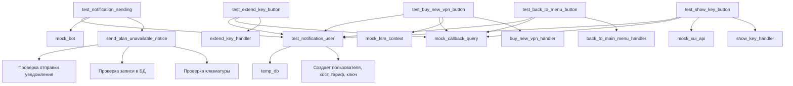
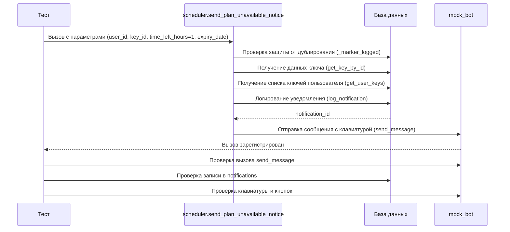
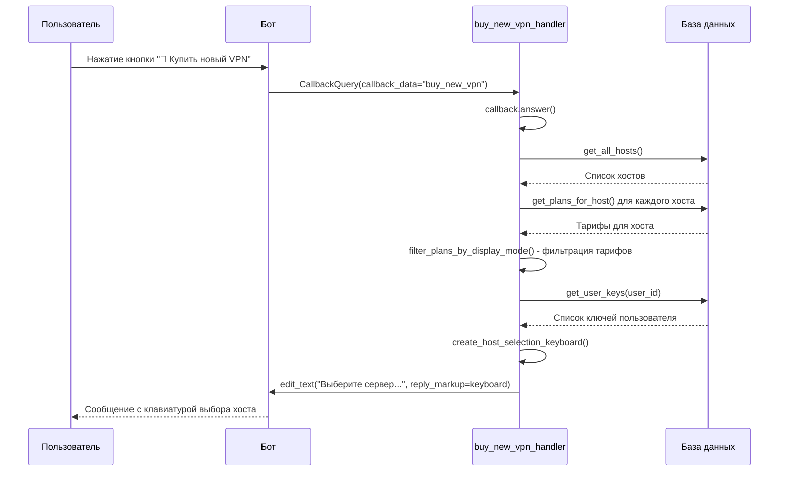
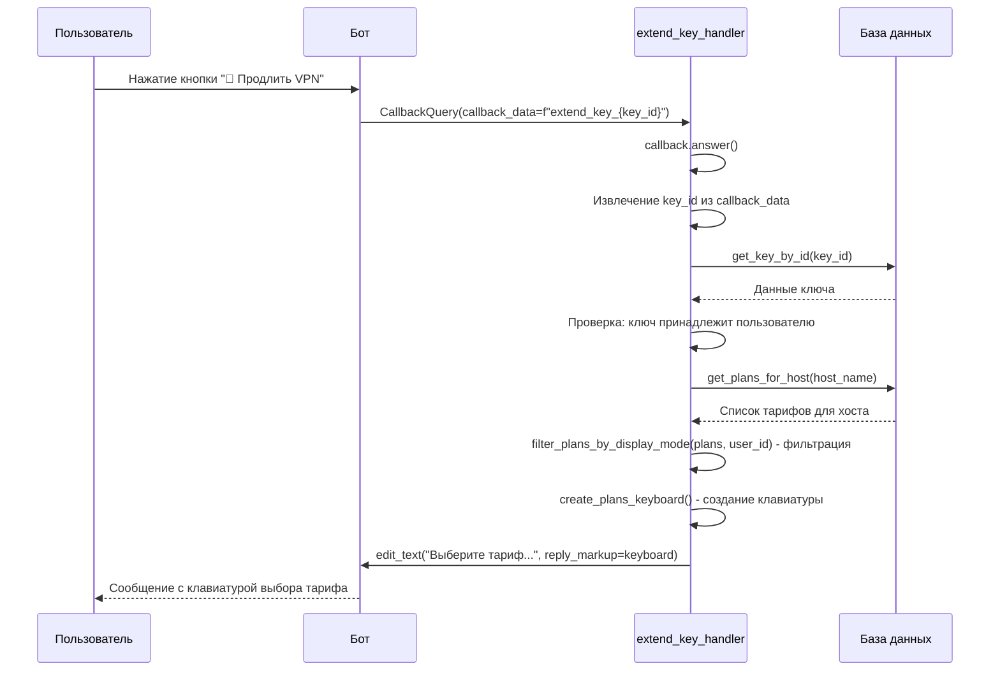
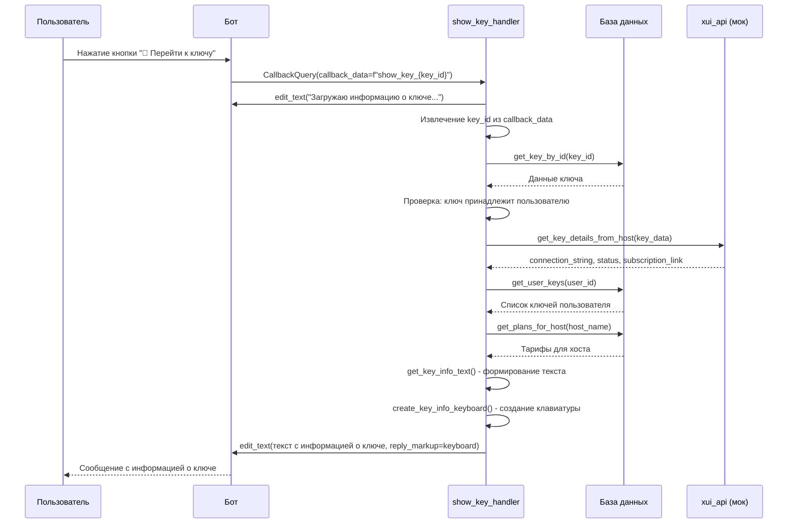
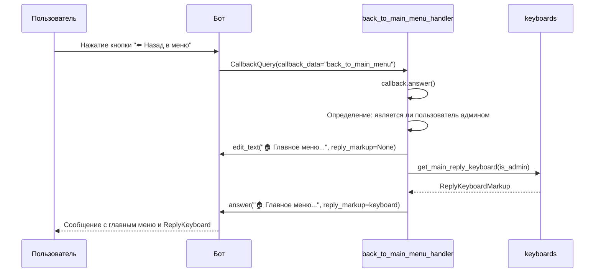

# 📋 Тест проверки бизнес-логики всех кнопок уведомления об истечении ключа

**Дата создания:** 20.01.2025  
**Тест:** `integration.test_auto_renewal.test_notification_buttons_flow.TestNotificationButtonsFlow`  
**Статус:** ✅ Реализовано

---

## 📖 Введение

### Назначение теста

Интеграционный тест проверяет полный flow работы всех кнопок из уведомления о недоступном тарифе для автопродления. Уведомление отправляется пользователю, когда его текущий тариф становится недоступным для автоматического продления ключа, и предлагает 4 варианта действий:

1. **🛒 Купить новый VPN** — переход к покупке нового ключа
2. **🔄 Продлить VPN** — продление существующего ключа другим тарифом
3. **🔑 Перейти к ключу** — просмотр информации о текущем ключе
4. **⬅️ Назад в меню** — возврат в главное меню

### Контекст использования

Уведомление отправляется автоматически через функцию `send_plan_unavailable_notice()` из модуля `scheduler.py`, когда:

- Ключ пользователя истекает в ближайшее время (например, через 1, 12 или 24 часа)
- Тариф, на котором был создан ключ, больше не доступен для автопродления (удален, скрыт или изменился)
- Автопродление включено у пользователя, но автоматическое продление невозможно

### Связь с бизнес-логикой автопродления

Тест является частью системы проверки автопродления (`test_auto_renewal`) и дополняет существующие тесты процесса автопродления, проверяя сценарий, когда автопродление **не может быть выполнено** из-за недоступности тарифа.

---

## 🏗️ Архитектура теста

### Структура файлов и расположение

```
tests/
└── integration/
    └── test_auto_renewal/
        └── test_notification_buttons_flow.py
```

### Используемые фикстуры и их назначение

#### 1. `temp_db` (из `conftest.py`)

**Назначение:** Создает временную SQLite БД с полной структурой таблиц для изоляции тестов.

**Использование:**
```python
@pytest.fixture
def temp_db():
    """Создает временную БД для теста"""
    # Создает БД, заполняет структуру, возвращает Path
    # После теста автоматически удаляется
```

**Важно:** Все тесты должны использовать `temp_db`, а не реальную БД `users.db`.

#### 2. `mock_bot` (из `conftest.py`)

**Назначение:** Мок объекта `aiogram.Bot` для изоляции от реального Telegram API.

**Использование:**
```python
@pytest.fixture
def mock_bot():
    """Создает мок Telegram бота"""
    bot = MagicMock(spec=Bot)
    bot.send_message = AsyncMock()
    return bot
```

#### 3. `mock_xui_api` (из `conftest.py`)

**Назначение:** Мок для API 3X-UI (xui_api) для изоляции от реального VPN-сервера.

**Использование:**
```python
@pytest.fixture
def mock_xui_api():
    """Создает мок XUI API"""
    xui_api = MagicMock()
    xui_api.get_key_details_from_host = AsyncMock()
    return xui_api
```

#### 4. `test_notification_user` (специальная фикстура)

**Назначение:** Создает тестового пользователя с ключом, истекающим через 1 час.

**Структура:**
```python
@pytest.fixture
def test_notification_user(temp_db):
    """Фикстура для тестового пользователя с ключом"""
    # Создает пользователя, хост, тариф, ключ
    yield {
        'user_id': user_id,
        'key_id': key_id,
        'host_name': host_name,
        'expiry_date': expiry_date,
        'expiry_ms': expiry_ms,
    }
```

**Возвращает:**
- `user_id` (int) — ID тестового пользователя
- `key_id` (int) — ID созданного ключа
- `host_name` (str) — имя хоста
- `expiry_date` (datetime) — дата истечения ключа (UTC)
- `expiry_ms` (int) — дата истечения в миллисекундах

#### 5. `mock_callback_query` (специальная фикстура)

**Назначение:** Создает мок объекта `CallbackQuery` для симуляции нажатия кнопок.

**Структура:**
```python
@pytest.fixture
def mock_callback_query():
    """Фикстура для создания мока CallbackQuery"""
    callback = MagicMock(spec=CallbackQuery)
    callback.data = None  # устанавливается в тестах
    callback.from_user = MagicMock(spec=User)
    callback.from_user.id = 123500
    callback.answer = AsyncMock()
    callback.message.edit_text = AsyncMock()
    return callback
```

#### 6. `mock_fsm_context` (специальная фикстура)

**Назначение:** Создает мок объекта `FSMContext` для симуляции состояния FSM.

**Структура:**
```python
@pytest.fixture
def mock_fsm_context():
    """Фикстура для создания мока FSMContext"""
    state = MagicMock(spec=FSMContext)
    state.get_state = AsyncMock(return_value=None)
    state.set_state = AsyncMock()
    state.update_data = AsyncMock()
    return state
```

### Моки и их использование

Все внешние зависимости мокируются для изоляции тестов:

- **Telegram Bot API** → `mock_bot` (AsyncMock для `send_message`, `edit_message`, и т.д.)
- **3X-UI API** → `mock_xui_api` (AsyncMock для `get_key_details_from_host`)
- **Временная БД** → `temp_db` (путь к временной SQLite БД)

### Диаграмма архитектуры теста



---

## 📋 Описание тестовых сценариев

### Тест 1: Отправка уведомления с кнопками

**Тест:** `test_notification_sending`

**Что проверяется:**
- ✅ Корректность вызова функции `send_plan_unavailable_notice()`
- ✅ Отправка уведомления боту через `mock_bot.send_message`
- ✅ Запись уведомления в БД в таблицу `notifications`
- ✅ Наличие всех 4 кнопок в клавиатуре
- ✅ Правильность `callback_data` для каждой кнопки
- ✅ Правильность layout клавиатуры (`adjust(2, 1, 1)`)

**Диаграмма flow:**



**Шаги теста:**

1. **Подготовка тестового окружения** (`test_notification_user`)
   - Метод: `register_user_if_not_exists()`, `add_new_key()`, `create_host()`, `create_plan()`
   - Параметры: `user_id=123500`, `host_name='test_host'`, `expiry_ms` (через 1 час)
   - Ожидаемый результат: пользователь, ключ, хост и тариф созданы
   - Проверка: все данные созданы корректно

2. **Отправка уведомления с кнопками**
   - Метод: `send_plan_unavailable_notice()`
   - Параметры: `bot=mock_bot`, `user_id`, `key_id`, `time_left_hours=1`, `expiry_date`, `force=True`
   - Ожидаемый результат: уведомление отправлено, записано в БД
   - Проверка: `mock_bot.send_message.called == True`

3. **Проверка записи в БД**
   - Метод: SQL запрос к таблице `notifications`
   - Ожидаемый результат: уведомление записано с правильными данными
   - Проверка: `notification_id > 0`, правильный тип `'subscription_plan_unavailable'`, правильные метаданные

4. **Проверка клавиатуры**
   - Метод: парсинг `reply_markup` из вызова `send_message`
   - Ожидаемый результат: клавиатура содержит все 4 кнопки
   - Проверка: наличие всех кнопок с правильными `callback_data`:
     - `"buy_new_vpn"`
     - `f"extend_key_{key_id}"`
     - `f"show_key_{key_id}"`
     - `"back_to_main_menu"`

**Ожидаемый результат:**

Уведомление успешно отправлено пользователю с клавиатурой, содержащей все 4 кнопки:
- "🛒 Купить новый VPN" → `callback_data="buy_new_vpn"`
- "🔄 Продлить VPN" → `callback_data=f"extend_key_{key_id}"`
- "🔑 Перейти к ключу" → `callback_data=f"show_key_{key_id}"`
- "⬅️ Назад в меню" → `callback_data="back_to_main_menu"`

Уведомление записано в БД с правильными метаданными.

---

### Тест 2: Обработка кнопки "🛒 Купить новый VPN"

**Тест:** `test_buy_new_vpn_button`

**Что проверяется:**
- ✅ Корректность вызова обработчика `buy_new_vpn_handler`
- ✅ Отображение списка доступных хостов с тарифами
- ✅ Фильтрация хостов без доступных тарифов
- ✅ Корректность клавиатуры выбора хоста
- ✅ Проверка наличия кнопки "Назад" с правильным `callback_data`

**Диаграмма flow:**



**Шаги теста:**

1. **Подготовка тестового окружения** (`test_notification_user`)
   - Метод: `test_notification_user` фикстура
   - Ожидаемый результат: пользователь, ключ, хост и тариф созданы
   - Проверка: все данные созданы корректно

2. **Симуляция нажатия кнопки "Купить новый VPN"**
   - Метод: создание мок объекта `CallbackQuery` с `callback_data="buy_new_vpn"`
   - Параметры: `callback.data = "buy_new_vpn"`, `callback.from_user.id = user_id`
   - Ожидаемый результат: мок создан успешно
   - Проверка: `callback.data == "buy_new_vpn"`

3. **Вызов обработчика**
   - Метод: `buy_new_vpn_handler(callback, state)`
   - Параметры: `callback`, `FSMContext`
   - Ожидаемый результат: обработчик выполнен без ошибок
   - Проверка: `callback.answer.called == True`

4. **Проверка результата**
   - Метод: проверка вызова `callback.message.edit_text()`
   - Параметры: текст сообщения, клавиатура
   - Ожидаемый результат: сообщение отредактировано с правильным текстом и клавиатурой
   - Проверка: текст содержит "Выберите сервер", клавиатура содержит кнопки хостов

**Ожидаемый результат:**

Обработчик корректно обрабатывает нажатие кнопки и показывает список доступных хостов для покупки нового VPN ключа. Пользователь видит правильное сообщение с клавиатурой выбора хоста.

---

### Тест 3: Обработка кнопки "🔄 Продлить VPN"

**Тест:** `test_extend_key_button`

**Что проверяется:**
- ✅ Корректность вызова обработчика `extend_key_handler`
- ✅ Отображение списка доступных тарифов для продления
- ✅ Фильтрация тарифов по режиму отображения (`display_mode`)
- ✅ Корректность клавиатуры выбора тарифа
- ✅ Проверка правильности извлечения `key_id` из `callback_data`

**Диаграмма flow:**



**Шаги теста:**

1. **Подготовка тестового окружения** (`test_notification_user`)
   - Метод: `test_notification_user` фикстура
   - Ожидаемый результат: пользователь, ключ, хост и тариф созданы
   - Проверка: все данные созданы корректно

2. **Симуляция нажатия кнопки "Продлить VPN"**
   - Метод: создание мок объекта `CallbackQuery` с `callback_data=f"extend_key_{key_id}"`
   - Параметры: `callback.data = f"extend_key_{key_id}"`, `callback.from_user.id = user_id`
   - Ожидаемый результат: мок создан успешно
   - Проверка: `callback.data` содержит `key_id`

3. **Вызов обработчика**
   - Метод: `extend_key_handler(callback)`
   - Параметры: `callback`
   - Ожидаемый результат: обработчик выполнен без ошибок
   - Проверка: `callback.answer.called == True`

4. **Проверка результата**
   - Метод: проверка вызова `callback.message.edit_text()`
   - Параметры: текст сообщения, клавиатура
   - Ожидаемый результат: сообщение отредактировано с правильным текстом и клавиатурой
   - Проверка: текст содержит "Выберите тариф", клавиатура содержит кнопки тарифов

**Ожидаемый результат:**

Обработчик корректно обрабатывает нажатие кнопки и показывает список доступных тарифов для продления ключа. Пользователь видит правильное сообщение с клавиатурой выбора тарифа.

---

### Тест 4: Обработка кнопки "🔑 Перейти к ключу"

**Тест:** `test_show_key_button`

**Что проверяется:**
- ✅ Корректность вызова обработчика `show_key_handler`
- ✅ Мокирование `xui_api.get_key_details_from_host`
- ✅ Отображение информации о ключе
- ✅ Корректность клавиатуры с информацией о ключе
- ✅ Проверка правильности извлечения `key_id` из `callback_data`

**Диаграмма flow:**



**Шаги теста:**

1. **Подготовка тестового окружения** (`test_notification_user`)
   - Метод: `test_notification_user` фикстура
   - Ожидаемый результат: пользователь, ключ, хост созданы
   - Проверка: все данные созданы корректно

2. **Мокирование xui_api.get_key_details_from_host**
   - Метод: `AsyncMock` для `xui_api.get_key_details_from_host`
   - Параметры: возвращает `connection_string`, `status`, `subscription_link`
   - Ожидаемый результат: мок настроен успешно
   - Проверка: мок возвращает корректные данные

3. **Симуляция нажатия кнопки "Перейти к ключу"**
   - Метод: создание мок объекта `CallbackQuery` с `callback_data=f"show_key_{key_id}"`
   - Параметры: `callback.data = f"show_key_{key_id}"`, `callback.from_user.id = user_id`
   - Ожидаемый результат: мок создан успешно
   - Проверка: `callback.data` содержит `key_id`

4. **Вызов обработчика**
   - Метод: `show_key_handler(callback)`
   - Параметры: `callback`
   - Ожидаемый результат: обработчик выполнен без ошибок
   - Проверка: `callback.answer.called == True` (если есть)

5. **Проверка результата**
   - Метод: проверка вызова `callback.message.edit_text()`
   - Параметры: текст сообщения с информацией о ключе, клавиатура
   - Ожидаемый результат: сообщение отредактировано с правильной информацией о ключе
   - Проверка: текст содержит `connection_string` или информацию о ключе, клавиатура содержит кнопки

**Ожидаемый результат:**

Обработчик корректно обрабатывает нажатие кнопки и показывает информацию о ключе. Пользователь видит правильное сообщение с данными ключа и клавиатурой.

---

### Тест 5: Обработка кнопки "⬅️ Назад в меню"

**Тест:** `test_back_to_menu_button`

**Что проверяется:**
- ✅ Корректность вызова обработчика `back_to_main_menu_handler`
- ✅ Отображение главного меню
- ✅ Установка ReplyKeyboard через `keyboards.get_main_reply_keyboard()`
- ✅ Проверка правильности обработки `callback_data="back_to_main_menu"`

**Диаграмма flow:**



**Шаги теста:**

1. **Подготовка тестового окружения** (`test_notification_user`)
   - Метод: `test_notification_user` фикстура
   - Ожидаемый результат: пользователь создан
   - Проверка: пользователь существует

2. **Симуляция нажатия кнопки "Назад в меню"**
   - Метод: создание мок объекта `CallbackQuery` с `callback_data="back_to_main_menu"`
   - Параметры: `callback.data = "back_to_main_menu"`, `callback.from_user.id = user_id`
   - Ожидаемый результат: мок создан успешно
   - Проверка: `callback.data == "back_to_main_menu"`

3. **Вызов обработчика**
   - Метод: `back_to_main_menu_handler(callback)`
   - Параметры: `callback`
   - Ожидаемый результат: обработчик выполнен без ошибок
   - Проверка: `callback.answer.called == True`

4. **Проверка результата**
   - Метод: проверка вызова `callback.message.edit_text()` или `callback.message.answer()`
   - Параметры: текст сообщения с главным меню
   - Ожидаемый результат: сообщение отредактировано или отправлено с правильным текстом
   - Проверка: текст содержит "Главное меню" или аналогичный текст

**Ожидаемый результат:**

Обработчик корректно обрабатывает нажатие кнопки и показывает главное меню. Пользователь видит правильное сообщение с главным меню.

---

## 📚 Best Practices

### Использованные паттерны

#### 1. AAA Pattern (Arrange-Act-Assert)

Все тесты следуют паттерну AAA:

```python
@pytest.mark.asyncio
async def test_example(temp_db, test_notification_user, mock_callback_query):
    # Arrange: подготовка данных
    user_id = test_notification_user['user_id']
    mock_callback_query.data = "buy_new_vpn"
    
    # Act: выполнение действия
    await handler(mock_callback_query)
    
    # Assert: проверка результата
    mock_callback_query.answer.assert_called_once()
    mock_callback_query.message.edit_text.assert_called_once()
```

#### 2. Фикстуры для переиспользования

Используются существующие фикстуры из `conftest.py` и создаются специализированные фикстуры:

```python
@pytest.fixture
def test_notification_user(temp_db):
    """Фикстура для тестового пользователя с ключом"""
    # Создает пользователя, хост, тариф, ключ
    yield {'user_id': user_id, 'key_id': key_id, ...}
    # Cleanup происходит автоматически через temp_db
```

#### 3. Мокирование внешних зависимостей

Все внешние зависимости мокируются:

```python
# Telegram Bot API
mock_bot.send_message = AsyncMock()

# 3X-UI API
mock_xui_api.get_key_details_from_host = AsyncMock(return_value={...})

# Использование временной БД
database.DB_FILE = temp_db
```

#### 4. Типизация моков через `spec`

Используется `MagicMock(spec=...)` для типизации:

```python
callback = MagicMock(spec=CallbackQuery)
callback.from_user = MagicMock(spec=User)
state = MagicMock(spec=FSMContext)
```

### Рекомендации по написанию подобных тестов

1. **Используйте фикстуры для подготовки данных:**
   - Создавайте специализированные фикстуры для часто используемых сценариев
   - Используйте `yield` для правильной очистки ресурсов
   - Указывайте `scope="function"` для изоляции тестов

2. **Изолируйте тесты через моки:**
   - Всегда мокируйте внешние API (Telegram, платежи, VPN-серверы)
   - Используйте временную БД для изоляции данных
   - Не используйте реальные зависимости в тестах

3. **Используйте подробные Allure аннотации:**
   - `@allure.title()` — краткое описание теста
   - `@allure.description()` — подробное описание с markdown
   - `@allure.severity()` — уровень критичности
   - `@allure.tag()` — теги для фильтрации
   - `allure.step()` — логирование шагов
   - `allure.attach()` — прикрепление данных для отладки

4. **Следуйте AAA паттерну:**
   - Arrange — подготовка данных
   - Act — выполнение действия
   - Assert — проверка результата

5. **Используйте понятные имена:**
   - Имена тестов должны описывать, что проверяется
   - Используйте docstrings для описания тестов
   - Добавляйте комментарии для сложных проверок

### Примеры кода с комментариями

#### Пример 1: Тест отправки уведомления

```python
@pytest.mark.asyncio
@allure.title("Проверка отправки уведомления о недоступном тарифе с кнопками")
@allure.severity(allure.severity_level.CRITICAL)
async def test_notification_sending(self, temp_db, mock_bot, test_notification_user):
    """Тест отправки уведомления с проверкой кнопок и записи в БД"""
    # Arrange: подготовка данных
    user_id = test_notification_user['user_id']
    key_id = test_notification_user['key_id']
    expiry_date = test_notification_user['expiry_date']
    time_left_hours = 1
    
    # Патчинг DB_FILE для использования временной БД
    original_db_file = database.DB_FILE
    database.DB_FILE = temp_db
    
    try:
        # Act: отправка уведомления
        with allure.step("Отправка уведомления с кнопками"):
            await send_plan_unavailable_notice(
                bot=mock_bot,
                user_id=user_id,
                key_id=key_id,
                time_left_hours=time_left_hours,
                expiry_date=expiry_date,
                force=True,  # Используем force для гарантии отправки
            )
            allure.attach(str(user_id), "User ID", allure.attachment_type.TEXT)
        
        # Assert: проверка результата
        with allure.step("Проверка отправки уведомления боту"):
            assert mock_bot.send_message.called, "send_message должен быть вызван"
            mock_bot.send_message.assert_called_once()
    finally:
        # Cleanup: восстановление исходного значения DB_FILE
        database.DB_FILE = original_db_file
```

#### Пример 2: Тест обработки кнопки

```python
@pytest.mark.asyncio
@allure.title("Проверка обработки кнопки 'Купить новый VPN' из уведомления")
@allure.severity(allure.severity_level.CRITICAL)
async def test_buy_new_vpn_button(self, temp_db, test_notification_user, mock_callback_query, mock_fsm_context):
    """Тест обработки кнопки buy_new_vpn с проверкой списка хостов"""
    # Arrange: подготовка callback
    user_id = test_notification_user['user_id']
    mock_callback_query.data = "buy_new_vpn"
    mock_callback_query.from_user.id = user_id
    
    # Патчинг DB_FILE для использования временной БД
    database.DB_FILE = temp_db
    
    try:
        # Act: вызов обработчика
        with allure.step("Вызов обработчика buy_new_vpn_handler"):
            await handler(mock_callback_query, mock_fsm_context)
        
        # Assert: проверка результата
        with allure.step("Проверка вызова callback.answer()"):
            mock_callback_query.answer.assert_called_once()
        
        with allure.step("Проверка редактирования сообщения"):
            mock_callback_query.message.edit_text.assert_called_once()
            call_args = mock_callback_query.message.edit_text.call_args
            text = call_args[0][0] if call_args[0] else call_args[1].get('text', '')
            assert "Выберите сервер" in text or "сервер" in text.lower()
    finally:
        database.DB_FILE = original_db_file
```

### Частые ошибки и как их избежать

1. **Использование реальной БД вместо временной:**
   - ❌ **Не делайте:** Использовать `database.DB_FILE` напрямую
   - ✅ **Делайте:** Всегда используйте фикстуру `temp_db` и патчите `database.DB_FILE`

2. **Отсутствие мокирования внешних API:**
   - ❌ **Не делайте:** Вызывать реальные Telegram API или VPN-серверы
   - ✅ **Делайте:** Используйте `mock_bot`, `mock_xui_api` и другие моки

3. **Неправильная типизация моков:**
   - ❌ **Не делайте:** `MagicMock()` без `spec`
   - ✅ **Делайте:** `MagicMock(spec=CallbackQuery)` для типизации

4. **Отсутствие очистки ресурсов:**
   - ❌ **Не делайте:** Не восстанавливать `database.DB_FILE` после теста
   - ✅ **Делайте:** Используйте `try/finally` или `yield` в фикстурах

5. **Недостаточные проверки:**
   - ❌ **Не делайте:** Проверять только наличие вызова
   - ✅ **Делайте:** Проверяйте параметры вызова, состояние БД, текст сообщений

---

## 📊 Allure отчетность

### Как использовать Allure отчеты для отладки

Allure отчеты предоставляют детальную информацию о выполнении тестов:

1. **Список тестов** — все тесты с их статусом (PASSED, FAILED, SKIPPED)
2. **Детали теста** — шаги выполнения, вложения, скриншоты (если есть)
3. **Графики** — статистика выполнения тестов, длительность, тенденции
4. **Фильтры** — фильтрация по тегам, статусу, времени выполнения

### Структура аннотаций

#### `@allure.title()`

Краткое название теста, отображается в списке тестов:

```python
@allure.title("Проверка обработки кнопки 'Купить новый VPN' из уведомления")
```

#### `@allure.description()`

Подробное описание теста с markdown:

```python
@allure.description("""
Проверяет бизнес-логику обработки кнопки "🛒 Купить новый VPN" из уведомления 
о недоступном тарифе для автопродления.

**Что проверяется:**
- Корректность вызова обработчика buy_new_vpn_handler
- Отображение списка доступных хостов с тарифами
- ...

**Тестовые данные:**
- user_id: 123500
- key_id: создается через add_new_key
- ...
""")
```

#### `@allure.severity()`

Уровень критичности теста:

```python
@allure.severity(allure.severity_level.CRITICAL)  # CRITICAL, NORMAL, MINOR, TRIVIAL, BLOCKER
```

#### `@allure.tag()`

Теги для фильтрации:

```python
@allure.tag("notification", "buttons", "integration", "bot", "buy-vpn")
```

#### `allure.step()`

Логирование шагов выполнения:

```python
with allure.step("Отправка уведомления с кнопками"):
    await send_plan_unavailable_notice(...)

with allure.step("Проверка отправки уведомления боту"):
    assert mock_bot.send_message.called
```

#### `allure.attach()`

Прикрепление данных для отладки:

```python
allure.attach(str(user_id), "User ID", allure.attachment_type.TEXT)
allure.attach(json.dumps(meta, indent=2), "Метаданные уведомления", allure.attachment_type.JSON)
allure.attach(text, "Текст сообщения", allure.attachment_type.TEXT)
```

### Примеры хороших и плохих описаний

#### ✅ Хорошее описание:

```python
@allure.description("""
Проверяет бизнес-логику обработки кнопки "🛒 Купить новый VPN" из уведомления 
о недоступном тарифе для автопродления.

**Что проверяется:**
- Корректность вызова обработчика buy_new_vpn_handler
- Отображение списка доступных хостов с тарифами
- Фильтрация хостов без доступных тарифов

**Тестовые данные:**
- user_id: 123500 (создается через test_notification_user)
- key_id: создается через add_new_key

**Шаги теста:**
1. Подготовка тестового окружения
2. Симуляция нажатия кнопки
3. Вызов обработчика
4. Проверка результата

**Ожидаемый результат:**
Обработчик корректно обрабатывает нажатие кнопки и показывает список доступных 
хостов для покупки нового VPN ключа.
""")
```

#### ❌ Плохое описание:

```python
@allure.description("Тест кнопки buy_new_vpn")
# Нет подробностей, нет структуры, нет информации о том, что проверяется
```

### Использование attach для отладки

Используйте `allure.attach()` для прикрепления данных, которые помогут при отладке:

```python
# Прикрепление тестовых данных
allure.attach(str(user_id), "User ID", allure.attachment_type.TEXT)
allure.attach(str(key_id), "Key ID", allure.attachment_type.TEXT)

# Прикрепление результатов проверок
allure.attach(text, "Текст сообщения", allure.attachment_type.TEXT)
allure.attach(json.dumps(meta, indent=2), "Метаданные уведомления", allure.attachment_type.JSON)

# Прикрепление клавиатуры
allure.attach(
    "\n".join([f"{btn.text}: {btn.callback_data}" for btn in all_buttons]),
    "Кнопки клавиатуры",
    allure.attachment_type.TEXT
)
```

---

## 🐛 Отладка

### Как использовать Allure отчеты для отладки

1. **Просмотр шагов выполнения:**
   - В Allure отчете перейдите к тесту
   - Раскройте секцию "Test body"
   - Просмотрите шаги выполнения (`allure.step()`)

2. **Просмотр вложений:**
   - В секции "Attachments" просмотрите прикрепленные данные
   - Используйте JSON, TEXT, HTML вложения для анализа

3. **Просмотр ошибок:**
   - В секции "Error" просмотрите stack trace
   - Проверьте assert сообщения для понимания причины падения

4. **Фильтрация по статусу:**
   - Используйте фильтр "Failed" для просмотра упавших тестов
   - Используйте теги для фильтрации по категориям

### Частые проблемы и их решения

#### Проблема 1: Тест не находит обработчик в роутере

**Симптом:** `handler is None` в тесте

**Причина:** Обработчики определены внутри функции `get_user_router()`, поэтому их нельзя импортировать напрямую

**Решение:** Используйте альтернативный подход — создавайте тестовый обработчик на основе логики из `handlers.py`:

```python
# Создаем тестовый обработчик на основе логики из handlers.py
async def test_handler(callback, state):
    await callback.answer()
    # Логика обработчика
    await callback.message.edit_text(...)

# Вызываем тестовый обработчик
await test_handler(mock_callback_query, mock_fsm_context)
```

#### Проблема 2: Ошибка при работе с временной БД

**Симптом:** `sqlite3.OperationalError: no such table: notifications`

**Причина:** Временная БД не инициализирована со структурой таблиц

**Решение:** Убедитесь, что фикстура `temp_db` правильно создает структуру таблиц. Проверьте `conftest.py`:

```python
@pytest.fixture
def temp_db():
    """Создает временную БД с полной структурой"""
    # Должна создавать все таблицы, включая notifications
    ...
```

#### Проблема 3: Моки не работают

**Симптом:** `AttributeError: 'MagicMock' object has no attribute 'method_name'`

**Причина:** Мок не правильно настроен или не использует `spec`

**Решение:** Используйте `spec` для типизации:

```python
# Правильно
callback = MagicMock(spec=CallbackQuery)
callback.answer = AsyncMock()

# Неправильно
callback = MagicMock()
# может не иметь нужных атрибутов
```

#### Проблема 4: Тест падает из-за async/await

**Симптом:** `RuntimeError: coroutine 'test_function' was never awaited`

**Причина:** Тест не помечен `@pytest.mark.asyncio` или используется неправильный async паттерн

**Решение:** Убедитесь, что тест помечен маркером и использует `await`:

```python
@pytest.mark.asyncio
async def test_example():
    await async_function()  # Используйте await
```

### Логирование в тестах

Используйте стандартный logging для логирования в тестах:

```python
import logging

logger = logging.getLogger(__name__)

@pytest.mark.asyncio
async def test_example():
    logger.debug("Начало теста")
    # ... выполнение теста ...
    logger.debug("Тест завершен")
```

### Использование pytest flags для отладки

```bash
# Подробный вывод
pytest -v

# Очень подробный вывод
pytest -vv

# Остановка на первой ошибке
pytest -x

# Показать локальные переменные при ошибке
pytest -l

# Выполнить только конкретный тест
pytest tests/integration/test_auto_renewal/test_notification_buttons_flow.py::TestNotificationButtonsFlow::test_notification_sending

# Запустить тесты с определенным маркером
pytest -m integration
```

---

## 📑 Приложения

### Полные примеры кода с комментариями

См. файл `tests/integration/test_auto_renewal/test_notification_buttons_flow.py` для полных примеров кода с подробными комментариями.

### Ссылки на связанные тесты

- **[Тест процесса автопродления](test-auto-renewal-process-disabled-analysis.md)** — тесты процесса автопродления
- **[Тест фильтрации планов](test-plan-display-mode.md)** — тесты режимов отображения тарифов
- **[Тест личного кабинета](test-cabinet-provision-mode-cabinet.md)** — тесты личного кабинета

### Чек-лист проверки перед коммитом

- [ ] Все тесты проходят (`pytest tests/integration/test_auto_renewal/test_notification_buttons_flow.py`)
- [ ] Используется временная БД (`temp_db`), а не реальная
- [ ] Все внешние зависимости мокированы
- [ ] Все тесты имеют Allure аннотации (`@allure.title`, `@allure.description`, `@allure.severity`, `@allure.tag`)
- [ ] Все шаги логируются через `allure.step()`
- [ ] Тестовые данные прикрепляются через `allure.attach()`
- [ ] Тесты следуют AAA паттерну (Arrange-Act-Assert)
- [ ] Используются правильные маркеры (`@pytest.mark.integration`, `@pytest.mark.asyncio`, и т.д.)
- [ ] Код соответствует style guide проекта
- [ ] Все assert сообщения понятны и информативны

### Ссылки на документацию

- **[pytest документация](https://docs.pytest.org/)** — официальная документация pytest
- **[aiogram документация](https://docs.aiogram.dev/)** — официальная документация aiogram
- **[Allure документация](https://docs.qameta.io/allure/)** — официальная документация Allure Framework
- **[unittest.mock документация](https://docs.python.org/3/library/unittest.mock.html)** — документация по мокированию в Python

---

**Последнее обновление:** 20.01.2025

