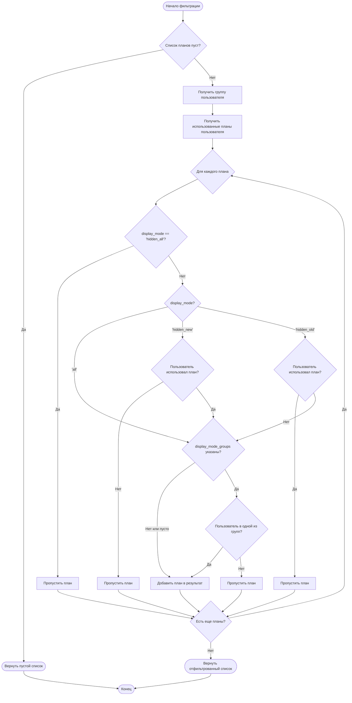

# Тестирование фильтрации планов по режиму отображения

> **Дата последней редакции:** 16.11.2025 08:24

## Обзор

Документация описывает тесты для функции `filter_plans_by_display_mode()`, которая фильтрует тарифные планы по режиму отображения (`display_mode`) и группам пользователей (`display_mode_groups`). Эта функция обеспечивает гибкую систему управления видимостью тарифов для разных категорий пользователей.

## Описание функции

### `filter_plans_by_display_mode(plans: list[dict], user_id: int) -> list[dict]`

Фильтрует список тарифных планов на основе режима отображения и принадлежности пользователя к группам.

**Параметры:**
- `plans` — список словарей с данными планов
- `user_id` — идентификатор пользователя (telegram_id)

**Возвращает:**
- Отфильтрованный список планов, которые должны быть видны пользователю

**Расположение:** `src/shop_bot/data_manager/database.py:3435`

## Режимы отображения

Функция поддерживает четыре режима отображения через параметр `display_mode`:

### 1. `'all'` — Показывать всем (по умолчанию)

План виден всем пользователям, независимо от их группы и истории использования тарифов.

**Использование:**
```python
create_plan(
    host_name="test-host",
    plan_name="План для всех",
    months=1,
    price=100.0,
    display_mode="all"
)
```

**Пример:**
- План доступен всем пользователям
- Работает совместно с `display_mode_groups` — если указаны группы, план виден только пользователям из этих групп

### 2. `'hidden_all'` — Скрыть у всех

План скрыт у всех пользователей, независимо от группы, истории использования и других настроек. Имеет **наивысший приоритет**.

**Использование:**
```python
create_plan(
    host_name="test-host",
    plan_name="Скрытый план",
    months=1,
    price=100.0,
    display_mode="hidden_all",
    display_mode_groups=[1]  # Игнорируется из-за hidden_all
)
```

**Важно:** Даже если указаны группы в `display_mode_groups`, план всё равно будет скрыт у всех пользователей.

### 3. `'hidden_new'` — Скрыть у новых пользователей

План скрыт только у новых пользователей, которые ни разу не использовали этот тариф. Пользователи, которые уже приобретали этот тариф, видят его.

**Использование:**
```python
create_plan(
    host_name="test-host",
    plan_name="План для постоянных клиентов",
    months=1,
    price=100.0,
    display_mode="hidden_new"
)
```

**Логика проверки:**
- Функция проверяет наличие оплаченных транзакций с `plan_id` в метаданных
- Если пользователь не использовал план — план скрыт
- Если пользователь использовал план — план виден

**Пример применения:**
- Специальные предложения для постоянных клиентов
- Планы, доступные только после первого использования

### 4. `'hidden_old'` — Скрыть у старых пользователей

План скрыт только у старых пользователей, которые уже использовали этот тариф. Новые пользователи, которые не использовали тариф, видят его.

**Использование:**
```python
create_plan(
    host_name="test-host",
    plan_name="План для новых клиентов",
    months=1,
    price=50.0,
    display_mode="hidden_old"
)
```

**Логика проверки:**
- Если пользователь использовал план — план скрыт
- Если пользователь не использовал план — план виден

**Пример применения:**
- Акции для новых клиентов
- Планы со специальной ценой для первой покупки

## Группы пользователей

Фильтрация по группам пользователей осуществляется через параметр `display_mode_groups`, который принимает список идентификаторов групп (`group_id`).

### Без фильтрации по группам

Если `display_mode_groups` не указан или пуст (`None` или `[]`), план показывается всем пользователям (с учетом `display_mode`).

```python
create_plan(
    host_name="test-host",
    plan_name="План без фильтрации",
    months=1,
    price=100.0,
    display_mode="all",
    display_mode_groups=None  # Или не указывать вообще
)
```

### Фильтрация по группам

Если указаны группы, план показывается только пользователям, принадлежащим к одной из указанных групп.

```python
# Создаем группы
vip_group_id = create_user_group("VIP", "VIP пользователи", "vip")
premium_group_id = create_user_group("Premium", "Premium пользователи", "premium")

# План только для VIP и Premium
create_plan(
    host_name="test-host",
    plan_name="VIP/Premium план",
    months=1,
    price=200.0,
    display_mode="all",
    display_mode_groups=[vip_group_id, premium_group_id]
)
```

**Логика проверки:**
1. Функция получает группу пользователя через `get_user_group_info(user_id)`
2. Если пользователь не в группе (`group_id` = `None`) или не в одной из указанных групп — план скрыт
3. Если пользователь в одной из указанных групп — план виден (при условии прохождения проверки `display_mode`)

## Приоритет режимов

Функция применяет фильтры в следующем порядке приоритета:

1. **ПРИОРИТЕТ 1: `display_mode = 'hidden_all'`**
   - Если режим `'hidden_all'`, план скрыт у всех пользователей
   - Дальнейшие проверки не выполняются

2. **ПРИОРИТЕТ 2: `display_mode` (кроме `'hidden_all'`)**
   - Проверка режимов `'all'`, `'hidden_new'`, `'hidden_old'`
   - Для `'hidden_new'` и `'hidden_old'` проверяется история использования

3. **ПРИОРИТЕТ 3: `display_mode_groups`**
   - Проверка принадлежности пользователя к указанным группам
   - Применяется только если `display_mode` пропустил план

**Важно:** `display_mode` имеет приоритет над `display_mode_groups`. Например, если `display_mode='hidden_all'`, план будет скрыт даже у пользователей из указанных в `display_mode_groups` групп.

## Диаграмма логики фильтрации



## Структура тестов

Все тесты находятся в файле `tests/unit/test_database/test_plan_display_mode.py` и организованы в классе `TestPlanDisplayMode`.

### Тесты режимов отображения

1. **`test_display_mode_all_visible_to_everyone`**
   - Проверяет, что планы с `display_mode='all'` видны всем пользователям
   - Тестирует работу без фильтрации по группам

2. **`test_display_mode_hidden_all_hidden_from_everyone`**
   - Проверяет, что планы с `display_mode='hidden_all'` скрыты у всех пользователей
   - Тестирует приоритет `hidden_all` над группами

3. **`test_display_mode_hidden_new_hidden_from_new_users`**
   - Проверяет, что планы с `display_mode='hidden_new'` скрыты у новых пользователей
   - Создает пользователей с разной историей использования

4. **`test_display_mode_hidden_old_hidden_from_old_users`**
   - Проверяет, что планы с `display_mode='hidden_old'` скрыты у старых пользователей
   - Тестирует обратную логику по сравнению с `hidden_new`

### Тесты фильтрации по группам

5. **`test_display_mode_groups_filter_by_groups`**
   - Проверяет фильтрацию планов по группам пользователей
   - Тестирует показ плана только пользователям из указанных групп

6. **`test_display_mode_groups_none_shows_to_everyone`**
   - Проверяет, что план без `display_mode_groups` показывается всем пользователям
   - Тестирует поведение при `None` или отсутствии групп

### Тесты приоритета

7. **`test_display_mode_priority_over_groups`**
   - Проверяет приоритет `display_mode` над `display_mode_groups`
   - Тестирует, что `hidden_all` скрывает план даже при указанных группах

### Тесты edge cases

8. **`test_edge_cases_empty_list`**
   - Проверяет обработку пустого списка планов
   - Должен возвращать пустой список без ошибок

9. **`test_edge_cases_plan_without_id`**
   - Проверяет обработку плана без `plan_id`
   - Тестирует поведение при отсутствии ID для проверки использования

10. **`test_edge_cases_user_without_group`**
    - Проверяет обработку пользователя без группы
    - Тестирует поведение при `group_id = NULL`

### Комплексный тест

11. **`test_complex_scenario_multiple_plans`**
    - Комплексный сценарий с несколькими планами и пользователями
    - Проверяет взаимодействие всех режимов и групп одновременно

## Примеры использования

### Пример 1: План для новых клиентов

```python
# Создаем план со скидкой для новых клиентов
create_plan(
    host_name="test-host",
    plan_name="Специальное предложение для новых",
    months=1,
    price=50.0,  # Скидка 50%
    display_mode="hidden_old"  # Скрыт у тех, кто уже покупал
)

# Новый пользователь видит план
# Старый пользователь не видит план
```

### Пример 2: Эксклюзивный план для VIP группы

```python
# Создаем VIP группу
vip_group_id = create_user_group("VIP", "VIP пользователи", "vip")

# Создаем эксклюзивный план
create_plan(
    host_name="test-host",
    plan_name="VIP план",
    months=3,
    price=500.0,
    display_mode="all",
    display_mode_groups=[vip_group_id]  # Только для VIP
)

# Только пользователи из VIP группы видят план
```

### Пример 3: План для постоянных клиентов

```python
# План доступен только тем, кто уже покупал другие тарифы
create_plan(
    host_name="test-host",
    plan_name="Лояльность",
    months=6,
    price=400.0,  # Выгодная цена за долгосрочный план
    display_mode="hidden_new"  # Скрыт у новых пользователей
)

# Пользователи, которые уже использовали планы, видят этот план
# Новые пользователи не видят план
```

### Пример 4: Временно скрытый план

```python
# Временно скрываем план для всех (например, для обновления цены)
create_plan(
    host_name="test-host",
    plan_name="Обновляемый план",
    months=1,
    price=100.0,
    display_mode="hidden_all"  # Скрыт у всех
)

# План скрыт у всех пользователей, независимо от группы
```

## Запуск тестов

### Запуск всех тестов фильтрации планов

```bash
# В Docker контейнере (рекомендуется)
docker compose exec autotest pytest tests/unit/test_database/test_plan_display_mode.py -v

# Локально
pytest tests/unit/test_database/test_plan_display_mode.py -v
```

### Запуск конкретного теста

```bash
# Тест режима 'all'
pytest tests/unit/test_database/test_plan_display_mode.py::TestPlanDisplayMode::test_display_mode_all_visible_to_everyone -v

# Тест приоритета
pytest tests/unit/test_database/test_plan_display_mode.py::TestPlanDisplayMode::test_display_mode_priority_over_groups -v
```

### Запуск с Allure отчетом

```bash
# Тесты автоматически сохраняют результаты в allure-results/
pytest tests/unit/test_database/test_plan_display_mode.py --alluredir=allure-results

# Просмотр отчета
# Откройте http://localhost:50005/allure-docker-service/projects/default/reports/latest/index.html
```

## Маркеры pytest

Все тесты используют следующие маркеры:

- `@pytest.mark.unit` — unit-тест
- `@pytest.mark.database` — тест работы с БД

## Allure аннотации

Все тесты содержат подробные Allure аннотации:

- `@allure.epic("База данных")` — эпик
- `@allure.feature("Фильтрация планов")` — фича
- `@allure.story("...")` — история (режим отображения, группы, edge cases)
- `@allure.description("...")` — подробное описание теста
- `@allure.step("...")` — шаги выполнения теста

Эти аннотации обеспечивают подробное описание в Allure отчете, что упрощает анализ результатов тестирования и понимание логики тестов.

## Связанные документы

- **[Структура тестов](testing-structure.md)** — общая структура тестов проекта
- **[Best Practices](best-practices.md)** — рекомендации по написанию тестов
- **[Allure отчеты](allure-reporting.md)** — работа с Allure Framework
- **[База данных](../../reference/database.md)** — документация по функциям БД

## Известные ограничения

1. **Проверка использования плана** основана на наличии оплаченных транзакций с `plan_id` в метаданных. Если транзакция не содержит `plan_id`, план не считается использованным.

2. **Пользователи без группы** (с `group_id = NULL`) не видят планы с фильтрацией по группам, даже если `display_mode='all'`.

3. **Планы без `plan_id`** не могут быть проверены на использование, поэтому режимы `hidden_new` и `hidden_old` не применяются к таким планам (они пропускают проверку использования).

## Будущие улучшения

1. Добавление поддержки временных ограничений (показывать план только в определенный период)
2. Добавление поддержки лимитов на количество показов плана
3. Добавление логирования фильтрации для аналитики

---

**Последнее обновление:** 16.11.2025 08:24
