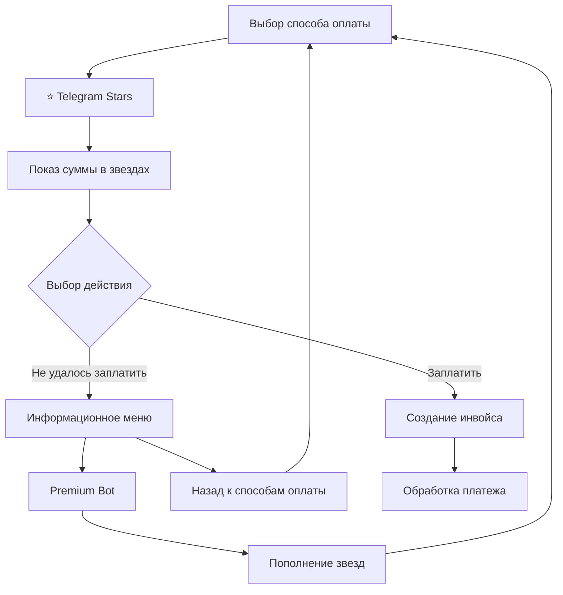

# Интеграция Telegram Stars

*Последнее обновление: 31.12.2024*

## Обзор

В проект успешно добавлена поддержка оплаты через Telegram Stars - новую валюту Telegram для внутриплатформенных платежей.

## Что было реализовано

### 1. Настройки в панели управления
- ✅ Добавлен чекбокс "Включить оплату звездами Telegram"
- ✅ Настройка курса конвертации для корректной статистики
- ✅ Кнопка автоматического обновления курса
- ✅ Настройки сохраняются в базе данных и применяются автоматически
- ✅ Исправлена структура интерфейса - настройки YooKassa вынесены в отдельный блок
- ✅ Добавлены tooltips для всех полей ввода

### 2. Обновление интерфейса бота
- ✅ Добавлена кнопка "⭐ Telegram Stars" в меню выбора способов оплаты
- ✅ Кнопка отображается только при включенной настройке `stars_enabled`
- ✅ Сохранена совместимость со всеми существующими способами оплаты
- ✅ Добавлена кнопка "Не удалось заплатить" во всех меню оплаты звездами
- ✅ Реализовано информационное меню с инструкциями по пополнению через Premium Bot

### 3. Обработка платежей
- ✅ Создание инвойса для оплаты звездами с валютой "XTR"
- ✅ Конвертация рублей в звезды по настраиваемому курсу
- ✅ Обработка pre-checkout запросов с валидацией
- ✅ Обработка успешных платежей с автоматической активацией подписки
- ✅ Двухэтапный процесс оплаты: выбор суммы → подтверждение → создание инвойса
- ✅ Обработка ситуаций, когда пользователь не может заплатить звездами

### 4. База данных
- ✅ Добавлена функция `create_pending_stars_transaction()` для создания pending транзакций
- ✅ Поддержка валюты "XTR" и метода платежа "Stars" в таблице transactions
- ✅ Логирование всех Stars транзакций с полными метаданными

## Технические детали

### Умная конвертация
- Пользователь платит: 100 RUB услуга = 100 звезд
- В статистике записывается: реальная стоимость в рублях (100 звезд × курс)
- Корректная финансовая отчетность
- Настраиваемый курс конвертации (по умолчанию 1.79 руб/звезда)

### Валидация платежей
- Проверка валюты (должна быть "XTR")
- Проверка суммы платежа
- Проверка существования пользователя
- Валидация метаданных

### Обработка ошибок
- Логирование всех операций
- Graceful fallback при ошибках
- Информативные сообщения для пользователей

## Совместимость

- ✅ Все существующие способы оплаты продолжают работать
- ✅ Никаких изменений в API внешних платежных систем
- ✅ Обратная совместимость с существующими транзакциями

## Безопасность

- ✅ Валидация всех входящих данных
- ✅ Проверка подлинности платежей через Telegram API
- ✅ Защита от дублирования транзакций
- ✅ Логирование для аудита

## Тестирование

Все компоненты интеграции протестированы:
- ✅ Конвертация рублей в звезды
- ✅ Создание метаданных платежа
- ✅ Структура инвойса для Stars
- ✅ Совместимость с существующим кодом

## Использование

1. Включите оплату звездами в панели управления
2. Настройте курс конвертации (по умолчанию 1.79)
3. Пользователи смогут выбирать "⭐ Telegram Stars" при оплате
4. При выборе оплаты звездами пользователь увидит:
   - Информацию о сумме к оплате в звездах
   - Кнопку "Заплатить [количество] ⭐" для создания инвойса
   - Кнопку "Не удалось заплатить" для получения помощи
5. Если пользователь не может заплатить, ему показывается:
   - Объяснение возможных причин (отсутствие валютной карты)
   - Ссылка на официальный Premium Bot для пополнения звезд
   - Кнопка возврата к выбору других способов оплаты
6. Все транзакции автоматически обрабатываются и логируются с корректными суммами

## Схема процесса оплаты

## Заключение

Интеграция Telegram Stars полностью готова к использованию и не влияет на существующую функциональность бота. Пользователи получают новый удобный способ оплаты, а администратор - дополнительный источник доходов через Telegram Stars.
