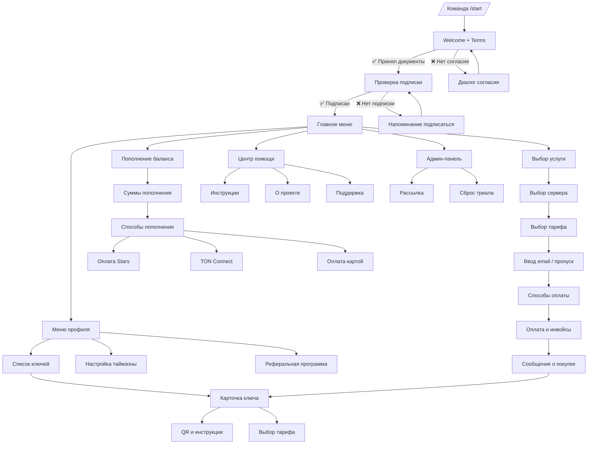

# 🗂️ Шаблоны сообщений и меню бота

> Дата последней редакции: 13.11.2025 15:59  
> Тип документа: Reference

Справочник объединяет все статические и полу-динамические сообщения бота Dark Maximus вместе с привязанными клавиатурами. По каждой точке сценария указаны триггеры, текст, состав кнопок и возможные переходы. Плейсхолдеры в фигурных скобках (`{variable}`) заполняются из кода.

## 📬 Шаблоны категории «Покупка»

| Название | Код | Категория | Текст | Кнопки | Описание |
|----------|-----|-----------|-------|--------|----------|
| Сообщение о покупке для режима «Ключ» | `purchase_success_key` | Покупка | 🎉 <b>Ваш ключ #{key_number}{trial_suffix} {action_text}!</b>  ⏳ <b>Он будет действовать до:</b> {expiry_formatted}  ⬇️ <b>НИЖЕ ВАШ КЛЮЧ</b> ⬇️ ------------------------------------------------------------------------ <code>{connection_string}</code> ------------------------------------------------------------------------ <blockquote>⁉️ Чтобы настроить VPN, перейдите по ссылке или нажмите на кнопку [⚙️ Настройка]</blockquote> {cabinet_text}{fallback_text} | <ul><li>⚙️ Настройка — WebApp `https://help.dark-maximus.com/setup`</li><li>🔄 Продлить этот ключ — callback `extend_key_{key_id}`</li><li>⬅️ Назад к списку ключей — callback `manage_keys`</li></ul> | Используется при выдаче нового ключа или продлении тарифа `key_provision_mode = "key"`. Требует валидный `{connection_string}`, автоматически добавляет `{cabinet_text}` при настроенном `user_cabinet_domain`.
| Сообщение о покупке для режима «Подписка» | `purchase_success_subscription` | Покупка | 🎉 <b>Ваш ключ #{key_number}{trial_suffix} {action_text}!</b>  ⏳ <b>Он будет действовать до:</b> {expiry_formatted}  ⬇️ <b>ВАША ПОДПИСКА</b> ⬇️ ------------------------------------------------------------------------ {subscription_link} ------------------------------------------------------------------------ <blockquote>⁉️ Чтобы настроить VPN, перейдите по ссылке или нажмите на кнопку [⚙️ Настройка]</blockquote> {cabinet_text}{fallback_text} | <ul><li>⚙️ Настройка — WebApp `https://help.dark-maximus.com/setup`</li><li>🔑 Подписка — внешняя ссылка `{subscription_link}` (показывается только при корректном http/https URL)</li><li>🔄 Продлить этот ключ</li><li>⬅️ Назад к списку ключей</li></ul> | Активируется, если тариф отдаёт только подписку и API вернул `{subscription_link}`. При отсутствии ссылки кнопка «🔑 Подписка» скрывается, текст остаётся.
| Сообщение о покупке для режима «Ключ + Подписка» | `purchase_success_both` | Покупка | 🎉 <b>Ваш ключ #{key_number}{trial_suffix} {action_text}!</b>  ⏳ <b>Он будет действовать до:</b> {expiry_formatted}  ⬇️ <b>НИЖЕ ВАШ КЛЮЧ</b> ⬇️ ------------------------------------------------------------------------ <code>{connection_string}</code> ------------------------------------------------------------------------  ⬇️ <b>ВАША ПОДПИСКА</b> ⬇️ ------------------------------------------------------------------------ {subscription_link} ------------------------------------------------------------------------ <blockquote>⁉️ Чтобы настроить VPN, перейдите по ссылке или нажмите на кнопку [⚙️ Настройка]</blockquote> {cabinet_text}{fallback_text} | <ul><li>⚙️ Настройка — WebApp `https://help.dark-maximus.com/setup`</li><li>🔑 Подписка — показывается при валидном `{subscription_link}`</li><li>🔄 Продлить этот ключ</li><li>⬅️ Назад к списку ключей</li></ul> | Применяется для тарифов `key_provision_mode = "both"`. Если отсутствует ключ или подписка, обработчик понижает режим до «Ключ».
| Сообщение о покупке для режима «Личный кабинет» | `purchase_success_cabinet` | Покупка | 🎉 <b>Ваш ключ #{key_number}{trial_suffix} {action_text}!</b>  ⏳ <b>Он будет действовать до:</b> {expiry_formatted}  ⬇️ <b>ВАШ ЛИЧНЫЙ КАБИНЕТ</b> ⬇️ ------------------------------------------------------------------------ <a href="{cabinet_url}">{cabinet_url}</a> ------------------------------------------------------------------------ <blockquote>⁉️ Чтобы настроить VPN, перейдите по ссылке или нажмите на кнопку [⚙️ Настройка]</blockquote> | <ul><li>⚙️ Настройка — WebApp `https://help.dark-maximus.com/setup`</li><li>🔄 Продлить этот ключ</li><li>⬅️ Назад к списку ключей</li></ul> | Для режимов `key_provision_mode = "cabinet"`. `{cabinet_url}` берётся из `user_cabinet_domain`, при HTTPS дополнительно создаётся токен `/auth/{token}`.
| Сообщение о покупке для режима «Личный кабинет + Подписка» | `purchase_success_cabinet_subscription` | Покупка | 🎉 <b>Ваш ключ #{key_number}{trial_suffix} {action_text}!</b>  ⏳ <b>Он будет действовать до:</b> {expiry_formatted}  ⬇️ <b>ВАШ ЛИЧНЫЙ КАБИНЕТ</b> ⬇️ ------------------------------------------------------------------------ <a href="{cabinet_url}">{cabinet_url}</a> ------------------------------------------------------------------------ <blockquote>⁉️ Чтобы настроить VPN, перейдите по ссылке или нажмите на кнопку [⚙️ Настройка]</blockquote> | <ul><li>⚙️ Настройка — WebApp `https://help.dark-maximus.com/setup`</li><li>🔑 Подписка — добавляется, если есть `{subscription_link}`</li><li>🔄 Продлить этот ключ</li><li>⬅️ Назад к списку ключей</li></ul> | Для `key_provision_mode = "cabinet_subscription"`. Если подписка не получена или домен без HTTPS, кнопка «🔑 Подписка» скрывается.

## 🧭 Reply-меню

| Меню | Триггер | Текст | Кнопки | Условия | Переходы |
|------|---------|-------|--------|---------|----------|
| Главное меню | `/start`, callback `back_to_main_menu`, завершение онбординга | 🏠 <b>Главное меню</b>  Выберите действие: | <ul><li>🛒 Купить</li><li>👤 Мой профиль</li><li>💰Пополнить баланс</li><li>⁉️ Помощь и поддержка</li><li>⚙️ Админ-панель (только админ)</li></ul> | Пользователь зарегистрирован, принял документы, подписан на канал (если требуется); админская кнопка показываетcя только для `ADMIN_ID`. | Ветки покупки, профиля, пополнения, помощи и админ-панели. |

## 👤 Профиль и ключи

| Меню | Триггер | Текст | Кнопки | Условия / режимы | Переходы |
|------|---------|-------|--------|------------------|----------|
| Меню профиля | Callback `show_profile`, сообщение «👤 Мой профиль» | 👤 <b>Профиль:</b> {username} 💰 <b>Баланс:</b> {balance:.2f} RUB 🔄 <b>Автопродление с баланса:</b> вкл/откл 🌍 <b>Часовой пояс:</b> {timezone_display} (если указан)  💸 <b>Потрачено всего:</b> {total_spent:.2f} RUB 📅 <b>Приобретено месяцев:</b> {total_months} ℹ️ <b>Статус VPN:</b> {vpn_status_text} Дополнительно: реферальный блок при `enable_referrals`. | <ul><li>🔑 Мои ключи</li><li>Автопродление с баланса (вкл/откл)</li><li>🌍 Изменить часовой пояс</li><li>🤝 Реферальная программа (если разрешена)</li><li>⬅️ Назад в меню</li></ul> | Требуются декораторы `documents_consent_required`, `subscription_required`; данные берутся из БД. | Управление ключами, рефералы, настройка таймзоны, возврат в главное меню. |
| Управление ключами | Callback `manage_keys`, кнопка «🔑 Мои ключи» | «Ваши ключи:» (если список не пуст) или «У вас пока нет ключей.» | Список ключей, «🆓 Пробный период», «➕ Купить новый ключ», «⬅️ Назад» | Учитывает `trial_used`, список ключей пользователя. | Карточка ключа, покупка нового ключа, запуск триала, возврат в профиль. |
| Карточка ключа | Callback `show_key_{id}`, уведомления о покупке | 🔑 <b>Ключ #{key_number}{trial_suffix}</b> 📅 <b>Создан:</b> {created_formatted} ⏳ <b>Истекает:</b> {expiry_formatted} 📡 <b>Статус:</b> {status_text}  <code>{connection_string}</code> {subscription_block}{cabinet_block} | <ul><li>⚙️ Настройка</li><li>🔑 Подписка (если URL валиден)</li><li>🔄 Продлить этот ключ</li><li>⬅️ Назад к списку ключей</li></ul> | Подтягивает статус, ссылку на подписку, токен кабинета. | Продление, инструкции, возврат к списку ключей. |
| QR-меню ключа | Callback `show_qr_{id}` | «📱 Отсканируйте QR-код через VPN приложение» (с вложенным изображением) | <ul><li>📑 Скопировать ключ</li><li>🌐 Инструкции❓</li><li>⬅️ Назад к списку ключей</li></ul> | Требуется `connection_string` для генерации QR. | Копирование ключа, просмотр инструкций, возврат. |
| Настройка таймзоны | Callback `change_timezone`, `tz_page:*`, `confirm_tz:*` | Шаг 1: 🌍 <b>Выбор часового пояса</b> + инструкция. Шаг 2: 🌍 <b>Подтверждение выбора</b> «Выбран: {timezone_display}… Подтвердите выбор…» | Список таймзон, пагинация, «⬅️ Назад в профиль», кнопки подтверждения | Доступно после онбординга; выделяет текущий пояс. | Установка таймзоны и возврат в профиль. |

## 🛒 Покупка и продление

| Меню | Триггер | Текст | Кнопки | Условия / режимы | Переходы |
|------|---------|-------|--------|------------------|----------|
| Выбор услуги | Сообщения «🛒 Купить», «🛒 Купить VPN», callback `buy_vpn_service_selection` | «Выберите услугу:» | <ul><li>🆕 Купить новый VPN</li><li>🔄 Продлить VPN</li><li>🆓 Пробный период VPN</li><li>⬅️ Назад в меню</li></ul> | Кнопки зависят от `total_keys_count`, `trial_used`. | Выбор сервера, переход к списку ключей или запуск триала, возврат. |
| Выбор сервера | Callbacks `buy_new_vpn`, `select_host_new_*`, `select_host_trial_*`, `extend_key_*` | «Выберите сервер, на котором хотите приобрести ключ:» / «…продлить ключ…» | Список серверов, «⬅️ Назад» (в профиль или к услугам) | Параметры `action` (new/extend/trial) и `back_to`. | Переход к тарифам, запуск триального ключа, возврат. |
| Выбор тарифа | Callbacks `select_host_new_*`, `extend_key_*` | «Выберите тариф для сервера “{host_name}”:» (или для продления ключа) | Кнопки с тарифами, «⬅️ Назад» | `action`, `key_id`, списки тарифов фильтруются по доступности. | Ввод email/оплата или возврат к выбору сервера. |

## 💳 Оплата и пополнение

| Меню | Триггер | Текст | Кнопки | Условия | Переходы |
|------|---------|-------|--------|---------|----------|
| Суммы пополнения | Сообщение «💰Пополнить баланс», callbacks `topup_root`, `topup_back_to_amounts` | «Выберите сумму пополнения:» | <ul><li>179 / 300 / 500 рублей</li><li>Ввести другую сумму</li><li>⬅️ Назад</li></ul> | Минимальная сумма из `minimum_topup`. | Выбор метода оплаты или возврат. |
| Способы пополнения | Callback `topup_amount_*`, `topup_back_to_payment_methods` | «Сумма пополнения: {amount} RUB» «Выберите способ оплаты:» | <ul><li>🏦 Карта / СБП</li><li>⭐ Stars</li><li>🪙 TonCoin</li><li>⬅️ Назад</li></ul> | Проверяет доступные платёжные методы. | Создание инвойсов, расчёт Stars/TON, возврат. |
| Способы оплаты заказа | Callbacks `pay_*`, состояние `PaymentProcess.waiting_for_payment_method` | «Вы выбрали {host}: {plan} — {price:.2f} RUB… Теперь выберите удобный способ оплаты.» (или «Выберите удобный способ оплаты») | <ul><li>💰 С баланса</li><li>🏦 Банковская карта</li><li>💎 Криптовалюта</li><li>🤖 CryptoBot</li><li>🪙 TonCoin</li><li>⭐ Stars</li><li>🎫 Применить промокод</li><li>⬅️ Назад</li></ul> | Список методов из состояния, учитывает баланс и промокоды. | Запуск конкретного платежного сценария, применение промокода, возврат к тарифу/email. |
| Оплата Stars | Callbacks `topup_pay_stars`, `pay_stars` | «Заплатить {N} ⭐» + подсказка «Не удалось заплатить» | <ul><li>Заплатить {N} ⭐</li><li>Не удалось заплатить</li></ul> | Нужна рассчитанная сумма Stars. | Создание или повтор счета, переход к fallback. |
| Fallback Stars | Callbacks `stars_payment_failed`, `topup_stars_payment_failed` | «Оплата не прошла. Выберите, что делать дальше.» | <ul><li>Пополнить RUB</li><li>Назад</li></ul> | Показывается после неудачной оплаты. | Возвращает к методам оплаты. |
| TON Connect | Callbacks `pay_tonconnect`, `topup_pay_tonconnect` | Инструкция + «Сумма к оплате: {price_ton} TON» Кнопка «🚀 Открыть кошелек» и QR | <ul><li>🚀 Открыть кошелек</li><li>⬅️ Назад</li></ul> | Требует настроенный TON-кошелёк и расчёт суммы. | Генерация ссылки/QR, возврат. |
| Переход к оплате | Callbacks платёжных провайдеров | «Нажмите на кнопку ниже для оплаты:» | <ul><li>Перейти к оплате</li><li>⬅️ Назад</li></ul> | Платёжная ссылка сформирована. | Открывает оплату или возвращает к тарифу/методам. |
| Пропуск email | Состояние `PaymentProcess.waiting_for_email` | «📧 Пожалуйста, введите ваш email… Если не хотите указывать почту, нажмите кнопку ниже.» | <ul><li>➡️ Продолжить без почты</li><li>⬅️ Назад к тарифам</li></ul> | Пользователь на шаге ввода email. | Продолжает оплату или возвращает к тарифу. |
| Возврат к методам оплаты | Служебные сообщения оплаты | «⬅️ Назад к способам оплаты» | <ul><li>⬅️ Назад к способам оплаты</li></ul> | Используется в fallback/уведомлениях. | Возвращает к списку методов оплаты. |

## 📚 Инструкции и onboarding

| Меню | Триггер | Текст | Кнопки | Условия | Переходы |
|------|---------|-------|--------|---------|----------|
| Центр помощи | Сообщение «⁉️ Помощь и поддержка», callback `help_center` | Пользовательский текст из `support_content` или «⁉️ Помощь и поддержка:» | <ul><li>🆘 Поддержка</li><li>🌐 Инструкции❓</li><li>ℹ️ О проекте</li><li>⬅️ Назад</li></ul> | Флаг `support_enabled`, наличие контента. | Инструкции, описание проекта, поддержка, возврат. |
| Инструкции по платформам | Callback `howto_vless` | HOWTO_CHOOSE_OS_MESSAGE: «Выберите операционную систему устройства для получения инструкции…» | Кнопки платформ, «🎬 Видеоинструкции», «⬅️ Назад» | Настройки отображения платформ и видео. | Переход к платформам/видео, возврат. |
| Инструкции для ключа | Callback `howto_vless_{id}` | HOWTO_CHOOSE_OS_MESSAGE + «⬅️ Назад к ключу» | Платформы, «🎬 Видеоинструкции», «⬅️ Назад к ключу» | Требуется доступ к ключу. | Инструкции или возврат к карточке ключа. |
| Видеоинструкции | Callback `video_instructions_list` | Список «▶️ {title}» + описания из БД | Список роликов, «⬅️ Назад» | Видео должны быть загружены в БД. | Просмотр/возврат. |
| Welcome / обязательная подписка | Онбординг `/start` | Welcome-текст из настроек: ссылки на канал, документы, кнопка «✅ Я подписался» | Ссылки на канал/Terms/Privacy, кнопка подтверждения | `force_subscription`, `terms_url`, `privacy_url`. | Проверка подписки, завершение онбординга. |
| Согласие с условиями | Онбординг, callback `agree_to_terms_only` | «❌ Для использования бота необходимо согласиться с документами…» | Ссылки на документы, «✅ Я согласен с документами» | Должны быть публичные URL документов. | После согласия продолжается онбординг. |
| Проверка подписки | Callback `check_subscription_and_agree`, `check_subscription` | «📢 Перейти в канал» + «✅ Я подписался» (напоминание о проверке) | <ul><li>📢 Перейти в канал</li><li>✅ Я подписался</li></ul> | Настроен `channel_url`, включен `force_subscription`. | Повторная проверка или завершение онбординга. |
| Меню «О проекте» | Сообщение «ℹ️ О проекте» | Динамический текст из настроек с ссылками | <ul><li>Канал</li><li>Terms</li><li>Privacy</li><li>⬅️ Назад</li></ul> | Ссылки должны вести на публичные домены. | Возврат в центр помощи. |
| Поддержка | Сообщение «🆘 Поддержка» | Настройка `support_content` или дефолт «Для связи с поддержкой используйте кнопку ниже.» | <ul><li>🆘 Написать в поддержку</li><li>⬅️ Назад</li></ul> | Настроен username/URL поддержки. | Открытие поддержки или возврат. |

## 🤝 Реферальная программа и вывод

| Меню | Триггер | Текст | Кнопки | Условия | Переходы |
|------|---------|-------|--------|---------|----------|
| Реферальная программа | Сообщение/Callback «🤝 Реферальная программа» | Реферальный баланс, <code>{referral_link}</code>, подсказка по заявке | <ul><li>💸 Оставить заявку на вывод средств</li><li>⬅️ Назад</li></ul> | `enable_referrals = true`, баланс ≥ 100 RUB для кнопки заявки. | Подача заявки или возврат в профиль. |
| Выбор способа вывода | Callback `withdraw_request` | «Выберите способ вывода средств» | <ul><li>📱 По номеру телефона</li><li>💳 По номеру карты</li><li>⬅️ Назад</li></ul> | Баланс ≥ 100 RUB. | Переход к выбору банка или вводу реквизитов. |
| Выбор банка | Callback `withdraw_method_phone` | «Выберите банк для вывода по телефону» | Список банков, «⬅️ Назад» | Метод вывода = телефон. | Сохраняет банк, затем запрос реквизитов. |
| Одобрение/отклонение заявки | Админское уведомление | «Заявка #{id} на вывод {amount} RUB…» | <ul><li>✅ Одобрить</li><li>❌ Отклонить</li></ul> | Доступно только администраторам. | Запускает обработчики одобрения/отклонения. |

## 🛠️ Админ-панель и рассылки

| Меню | Триггер | Текст | Кнопки | Условия | Переходы |
|------|---------|-------|--------|---------|----------|
| Админ-панель | Сообщение «⚙️ Админ-панель» (только админ) | ⚙️ <b>Админ-панель</b>  Выберите действие: | <ul><li>📢 Рассылка</li><li>🔄 Сбросить триал</li><li>⬅️ Назад в меню</li></ul> | Проверка `ADMIN_ID`. | Запуск сценариев рассылки/сброса триала, возврат в главное меню. |
| Рассылка — опции | Состояние `Broadcast.waiting_for_message` | «Сообщение получено. Хотите добавить к нему кнопку со ссылкой?» | <ul><li>➕ Добавить кнопку</li><li>➡️ Пропустить</li><li>❌ Отмена</li></ul> | Только админ. | Ввод текста кнопки, пропуск, отмена. |
| Рассылка — подтверждение | Состояние `Broadcast.waiting_for_confirmation` | «Проверьте превью рассылки. Отправить всем?» | <ul><li>✅ Отправить всем</li><li>❌ Отмена</li></ul> | Только админ. | Отправка рассылки или отмена. |
| Рассылка — отмена | Любой шаг сценария | «Рассылка отменена. Возвращаюсь в админ-панель.» | <ul><li>❌ Отмена</li></ul> | Только админ. | Прерывает сценарий и возвращает к админ-панели. |
| Сброс пробного периода | Callback `admin_reset_trial` | «Подтвердить сброс пробного периода для пользователя {user_id}?» | <ul><li>✅ Подтвердить сброс</li><li>❌ Отмена</li></ul> | Только админ. | Подтверждает или отменяет сброс, возврат в админ-панель. |

## 🧰 Служебные элементы

| Элемент | Триггер | Текст | Кнопки / Назначение | Контекст |
|---------|---------|-------|---------------------|----------|
| Кнопка «В главное меню» | Уведомления, транзакции, ошибки | «⬅️ Назад в главное меню» | Inline-кнопка `get_main_menu_button` для быстрого возврата | Любые сервисные сообщения. |
| Кнопка «Купить подписку» | Уведомления о продлении/покупке | «Купить подписку» | Inline-кнопка `get_buy_button` запускает ветку покупки | Используется в напоминаниях. |
| Возврат в меню | Служебные сообщения, fallback | «⬅️ Назад в меню» | `create_back_to_menu_keyboard` | Применяется в поддержке и ошибках. |

## 📈 Диаграмма переходов

